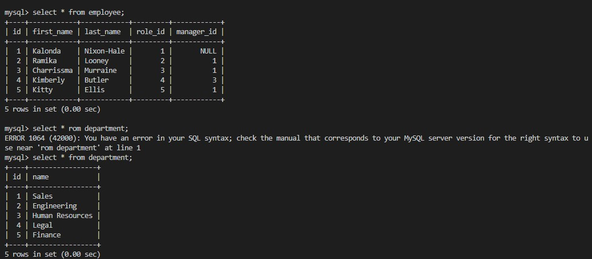
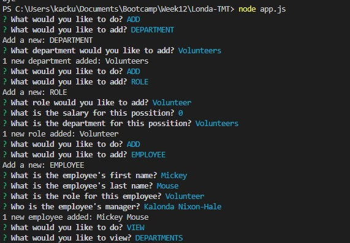
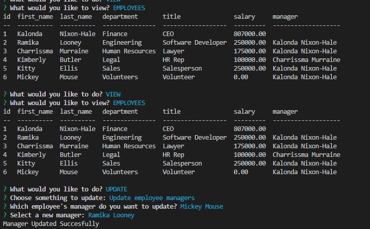

# Londa-TMT

## Action Needed
Create a Node.js command-line application with MySQL that allows non-developers to easily view and interact with information stored in databases. The user will be able to use the team member (TM)/ employee tracker to add, delete, update and view the information stored on this database, which is known as a "Content Management System" (CMS).

## Action Taken
* Used Inquirer package to prompt the user with a series of prompts regarding which data would like to be viewed/modified/deleted (departments, employees, role ID, etc.) via the command-line interface.
* Used MySQL for the database management interface to create the employees database with tables that "join" to other tables linked with IDs.
* Used console.table to print the rows in the MySQL console.
* Implemented bonus item

## Screenshot 

 

## Video Link
https://drive.google.com/file/d/1NoQ4rf2GGtZztlTzCaOY2sqnkY-Dlhdy/view

## Github Link
https://github.com/LondaNH/Londa-TMT
